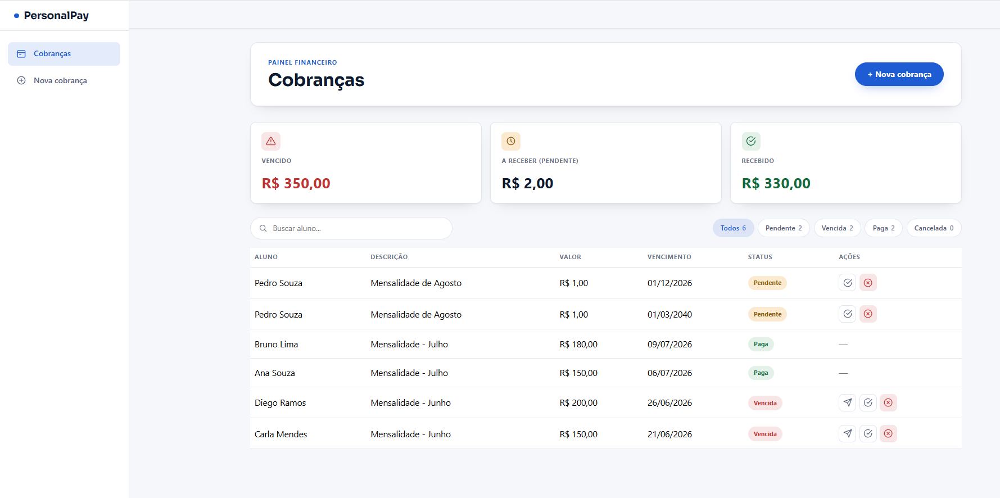
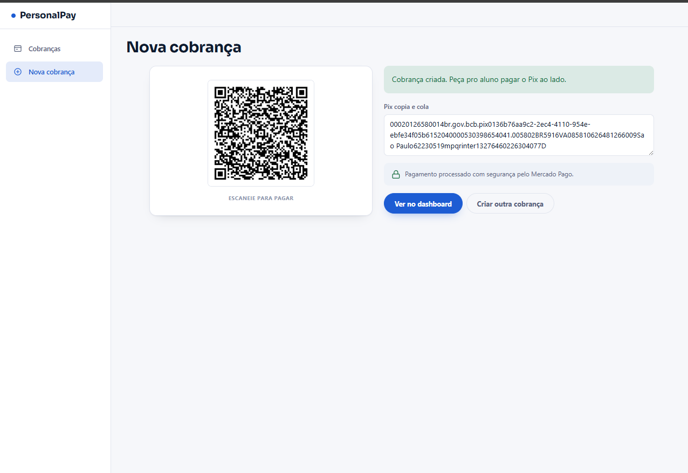

# PersonalPay

[](https://github.com/victoraugustovalle/PersonalPay/actions/workflows/ci.yml)





Mini sistema de cobrança para personal trainers autônomos: cadastra aluno, gera cobrança de mensalidade via **Pix** (Mercado Pago), acompanha o pagamento em tempo real e manda lembrete automático por **WhatsApp** quando a cobrança vence sem pagamento.

O objetivo é demonstrar, em escopo pequeno e completo, um fluxo real de: integração com gateway de pagamento, processamento assíncrono de webhook via fila, e integração com WhatsApp Business API.

## Stack

- **.NET 10** — Blazor Server (um único projeto: API + dashboard interativo, sem front-end separado)
- **EF Core + SQLite** — persistência simples, sem infraestrutura externa
- **Mercado Pago** (SDK oficial `mercadopago-sdk`) — geração de cobrança Pix via Payments API
- **Meta WhatsApp Cloud API** — lembrete de cobrança vencida via mensagem template
- `System.Threading.Channels` — fila em memória entre o webhook e o processamento

## Fluxo

1. Cadastra aluno + cria cobrança → API do Mercado Pago gera o QR Pix (copia e cola + imagem).
2. Aluno paga → Mercado Pago notifica `/webhooks/mercadopago`.
3. O endpoint valida a assinatura (`x-signature`), verifica se já processou aquela notificação (idempotência) e só então enfileira.
4. Um `BackgroundService` consome a fila, consulta o status real do pagamento na API e atualiza a cobrança.
5. O dashboard atualiza sozinho (Blazor Server já mantém uma conexão viva por usuário — sem precisar de F5 nem de um Hub de SignalR à parte).
6. Um segundo `BackgroundService` roda periodicamente: cobrança pendente com vencimento no passado vira "Vencida" e dispara um lembrete por WhatsApp — uma vez só por cobrança.

## Rodando localmente

```bash
cd PersonalPay.Web
dotnet run
```

Abre em `http://localhost:5289` (ou a porta que o `dotnet run` mostrar). Sem nenhuma credencial configurada, dá pra cadastrar aluno e criar cobrança normalmente — só a geração do QR Pix e o envio de WhatsApp vão logar um aviso claro pedindo a credencial que falta, em vez de quebrar.

## Configurando as credenciais (sandbox — grátis)

Todas via `dotnet user-secrets` (dentro de `PersonalPay.Web/`) — nunca commitadas.

### Mercado Pago

1. Crie uma conta em [mercadopago.com.br/developers](https://www.mercadopago.com.br/developers) e pegue as credenciais de **teste** (Access Token).
2. Configure o webhook no painel (Suas integrações → sua aplicação → Webhooks) apontando pra `https://SEU-HOST/webhooks/mercadopago` — localmente, use algo como `ngrok` pra expor `http://localhost:5289`. Copie o "Assinatura secreta" gerada.

```bash
dotnet user-secrets set "MercadoPago:AccessToken" "TEST-..."
dotnet user-secrets set "MercadoPago:WebhookSecret" "..."
```

### WhatsApp (Meta Cloud API)

1. Crie um app em [developers.facebook.com](https://developers.facebook.com/), adicione o produto WhatsApp — ele já vem com um número de teste gratuito e permite mandar mensagem pra até 5 números verificados, sem precisar de conta empresarial aprovada.
2. Crie (e aguarde a aprovação — normalmente minutos, pra templates utilitários simples) um template de mensagem chamado `cobranca_vencida`, com 3 variáveis no corpo: nome do aluno, valor e data de vencimento.
3. Pegue o token de acesso e o Phone Number ID no painel do app.

```bash
dotnet user-secrets set "WhatsApp:Token" "..."
dotnet user-secrets set "WhatsApp:PhoneNumberId" "..."
```

## Estrutura

```
PersonalPay.Web/
  Models/       Cliente, Cobranca, WebhookEvento
  Data/         AppDbContext (EF Core)
  Services/     MercadoPagoService, WhatsAppService, fila, workers, notificador
  Components/Pages/
    Dashboard.razor       lista de cobranças + totais, atualiza em tempo real
    NovaCobranca.razor    cadastro de aluno + geração do Pix
```
